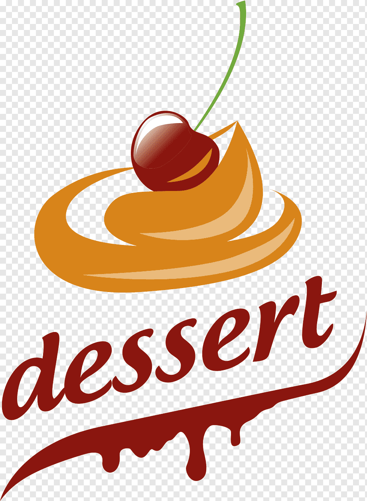
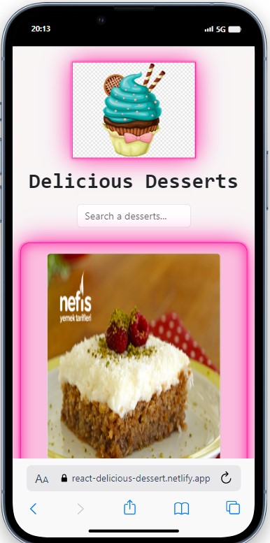
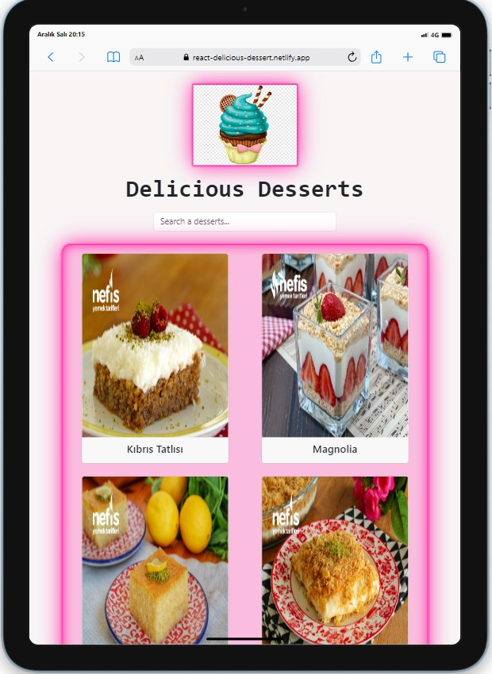
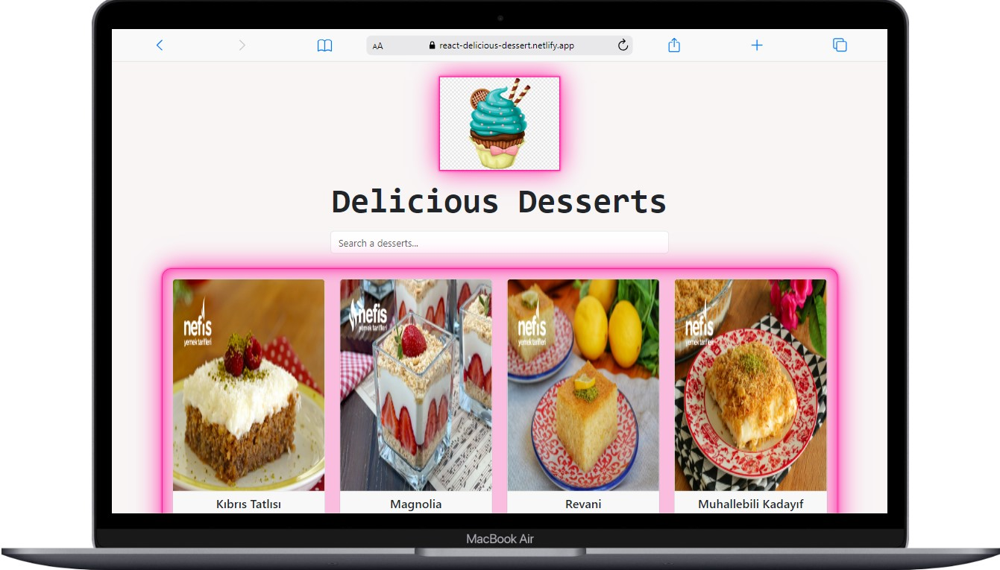

<!-- PROJECT LOGO -->
 

  

  <h3 align="center">D E S S E R T S</h3>

  

   We have selected the most popular desserts for you.
     
    <a href="https://react-delicious-dessert.netlify.app/"><strong> 🏀🏆LIVE »</strong></a>
     
  

<!-- ABOUT THE PROJECT -->
## About The Project

 
It was a nice project where I used components and scene structure.
I used React Bootstrap's container and card structure in my project. You can see the desserts and their calories

* In this project I filtered the data in the App.jsx file, then under the input field you can see the player based on the searched query  
* [x] useState  
* [x] Responsive  
* [x] React  
* [x] React-Bootstrap 
* [x] (extra) onMouseLeave : I heard this attribute when work on this project  

## On Mobile 📲

     
     
     

